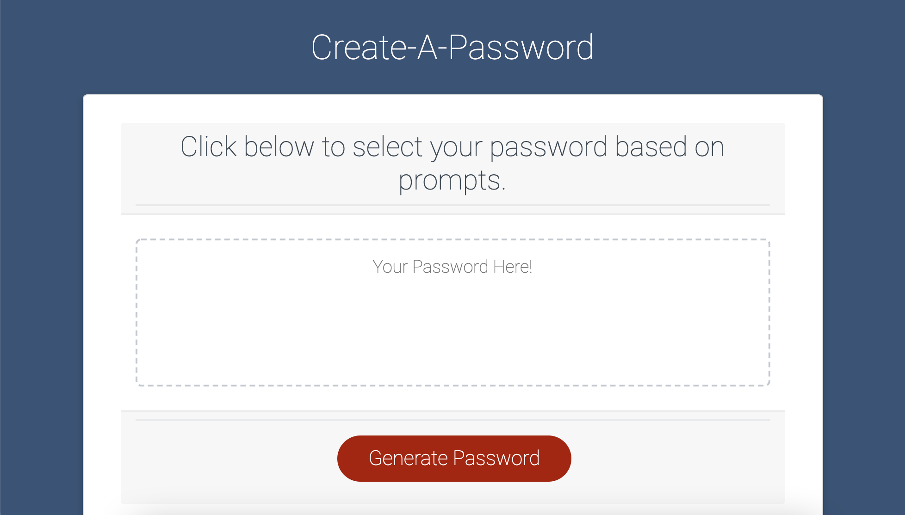
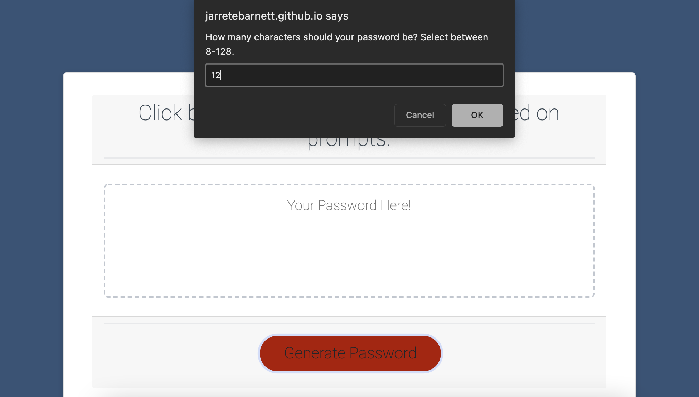
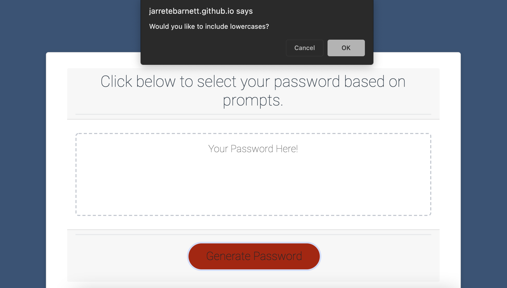
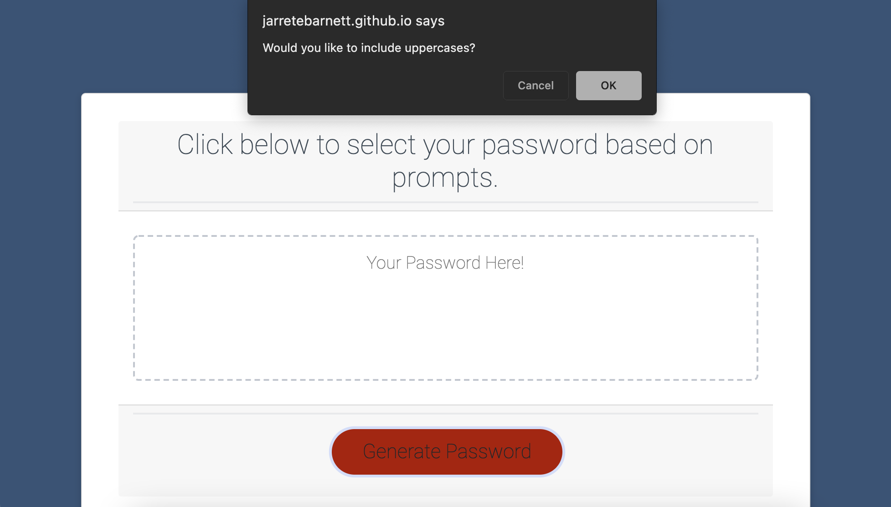
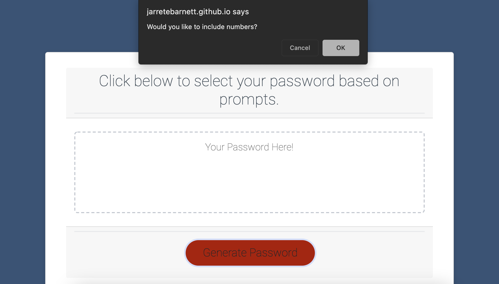
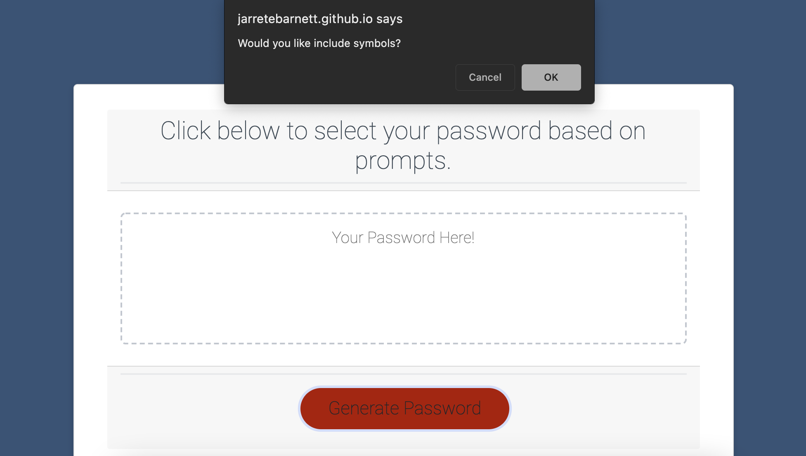
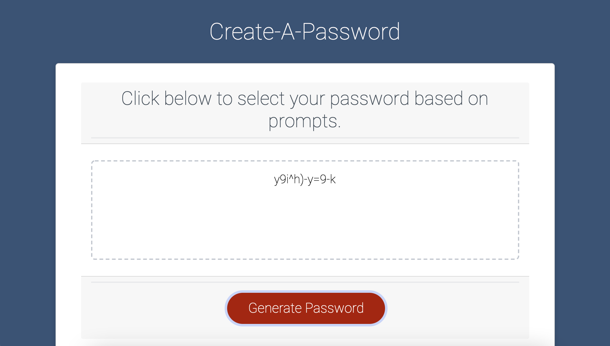

# Password Generator

Within this repository is a simple, straightforward password generator that takes user input and formulates the data into a randomized password, which can be used to bolster the users privacy and security on other sites (social media, banking, etc.).

## User Story

```
AS A USER I was a completely randomized, generated password to heighten the security of my accounts,
WHEN I am given a prompt, I am asked to enter a number of characters between 8-128,
THEN I am prompted on character types to confirm or dismiss inclusion in the password,
WHEN finished, the entered input is formulated accordingly to generate a unique password,
THEN the processed password is displayed on the page to be copied and pasted for use.
```

## Final Product

The final product is a functional page that runs a series of JavaScript prompts and displays an accurate representation of the criteria selected by the user.

Here is a screenshot of the initial page:



Next, is a series of prompts. The user is asked to choose characters between 8-128:



Then, the user is prompted to chose whether to include lowercase characters:



The user is then asked to chose or dismiss the following characters:





Then, the final result is displayed for the user to utilize:



The user has now successfully obtained a unique password for personal use that fits the criteria selected.